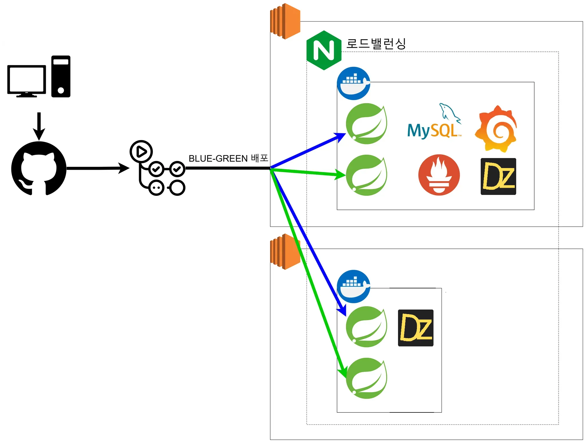

## 1.618 | 예술과 가치의 황금비

## 개요

대학생과 신진 작가를 위한 미술 작품 중개 서비스를 개발하였습니다.😀

졸업 전시 후 버려지는 작품들에 대한 문제성을 인식하고,  
소비자의 합리적인 가격대의 미술품 및 인테리어의 수요를 충족하자는 아이디어에서 시작하여  
해당 서비스를 기획•개발하게 되었습니다.  

 
이미지를 클릭하면 [1.618 홈페이지](http://1.618.s3-website.ap-northeast-2.amazonaws.com/) 로 이동합니다.

## 관련 리소스들
[프론트엔드 GitHub](https://github.com/kakao-tech-campus-2nd-step3/Team9_FE)  
[백엔드 GitHub](https://github.com/kakao-tech-campus-2nd-step3/Team9_BE)  

[Swagger](http://golden-ratio.duckdns.org/swagger-ui/index.html#/)  
[Figma](https://www.figma.com/design/B1WP5pDtbxGT5ZA42qfbM1/%EC%B9%B4%ED%85%8C%EC%BA%A0_step3-%5B1.618%5D?node-id=0-1&t=1Ysk1xzjdd4Px0RG-1)  

## 팀원

|Frontend|Frontend|
|:------:|:------:|
|||
|[김민주](https://github.com/joojjang)|[백승범](https://github.com/seung365)|

|Backend|Backend|Backend|Backend|Backend|
|:------:|:------:|:------:|:------:|:------:|
||||||
|[김동현](https://github.com/donghyuun)|[박한솔](https://github.com/pjhcsols)|[심규민](https://github.com/sim-mer)|[윤재용](https://github.com/yooonwodyd)|[주보경](https://github.com/jupyter471)|

## 기술 스택

### Frontend

### Backend

### DevOps

## 주요 개발 현황

### Frontend

#### 로그인 / 회원가입
카카오 로그인 경로로 리다이렉트하여 로그인 완료 시 액세스 토큰을 가져옵니다.  
회원가입이 아직 되지 않은 상태라면 회원가입 페이지로 리다이렉트받으며,  
일반 유저와 작가로 모드를 나누어 회원가입을 진행하며, 모드에 따라 다른 경로로 회원가입 API를 요청합니다.  
또한 UnivCert 및 국세청 사업자등록정보 API를 통해 학생 작가나 사업자 등록된 신진 작가를 검증했습니다. 

#### 피드 둘러보기
탠스택 쿼리의 useSuspenseInfiniteQuery를 호출하여 다양한 작품 이미지를 한눈에 볼 수 있게 화면을 제공합니다.  

#### 검색
사용자가 작품이나 작가, 찾고 싶은 작품의 키워드를 입력하면 검색 결과를 페칭합니다.  
최근 검색어, 검색 결과 정렬, 통합/작품/작가 검색 결과를 볼 수 있게 UI를 구성하여 UX를 고려하였습니다.  

#### 채팅
판매자(작가)와 수요자가 플랫폼 내에서 편리하게 연락을 주고받을 수 있도록 채팅을 구현했습니다.  
SockJS를 사용하여 웹소켓을 연결하고, STOMP 프로토콜 통신을 구현했습니다.  

#### 마이페이지
자신의 프로필을 확인 할 수 있습니다. 그리고 자신이 찜한 목록 및 팔로우 목록을 볼 수 있습니다.

### Backend
#### 회원가입
카카오 로그인을 통해 간편하게 회원등록을 할 수 있습니다.  

#### 작가 등록
작가로 등록하여 상품을 등록하고 판매하고 싶은 사용자는 사업자번호 또는 관련학과 전공자 인증을 통해 작가 프로필을 개선할 수 있습니다.  

#### 상품 관련 기능
작가는 상품 등록과 수정 삭제를 할 수 있습니다.  
상품 사진으로 10MB이하이고 확장자가 jpg,jpeg,png인 파일을 등록할 수 있습니다.  

#### 찜 기능
사용자는 마음에 드는 작품을 '찜' 기능을 사용하여 설정할 수 있습니다.  
사용자는 본인의 찜목록을 확인할 수 있습니다.  

#### 감상평 남기기 기능
사용자는 작품을 보고 감상평을 남길 수 있습니다.  

#### 채팅 기능
사용자는 구매를 원하는 작품의 작가에게 채팅으로 구매의사를 표현할 수 있습니다.  

#### 검색 기능
해시태그, 작가명, 상품명을 구분하여 검색할 수 있습니다.  

#### 인프라 구축

## 차후 개발 계획

### Frontend

- 유저 모드와 작가 모드를 나눈 부분을 더 활용하여 모드에 따라 유저들이 서비스를 편리하게 이용하도록 화면 구성 및  
탠스택 쿼리 서스펜스를 사용한 코드를 발전시켜 데이터 페칭 시 UX를 개선할 예정입니다.  
- API 통신 코드의 에러 핸들링을 개선할 예정입니다.  
- 미구현한 기능 -회원 정보 수정, 작품 포스팅, 내 갤러리, 채팅 이미지 전송- 을 이어서 구현할 예정입니다.  
- 프로젝트 구조를 개선하고 도메인을 분리할 예정입니다.  
- 중복되거나 성능 개선이 필요한 부분을 테스트 도구를 활용하여 개선할 예정입니다.
- 접근성을 높이기 위해서 PWA 적용할 예정입니다.  

### Backend

